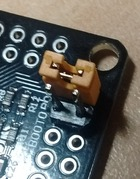

# STM32F407VG & Arduino
Notes on getting the "DIY" / "DIY-MORE" Chinese 'F407VG 1024k board working on __Arduino_Core_STM32__

THIS IS NOT AN OFFICIAL STM32/ARDUINO PROJECT 

This is an interim project for getting the $10 STM32F407VG Cortex-M4 Chinese board up and running on official STM32 core for Arduino IDE. This chip has a massive 1024k of flash and zillions of GPIO. The board is a breakout with zero frills. (On mine, the board maker has trouble spelling their own brand name.)

The STM32 core project currently does not have support for this '407VG board. (Only for STM's full functionality '407VG Discovery Board, including embedded stlink, audio, accelerometer, etc. That's NOT our own bare little '407VG board.) 

The variant listed here can be patched in to your copy of the core files. Current core base is 1.4.  If / when an official support is released in a later core version, then this variant here gets deleted in your upgrade, and becomes obsolete anyway!

The only thing that's not 100% generic in this configuration a #define of LED_BUILTIN to PE0, which this DIY board has.

## Installation:

1. You must install the STM32 core (official) board support from here:
   https://github.com/arduino/Arduino/wiki/Unofficial-list-of-3rd-party-boards-support-urls
   If you have an earlier version than 1.4, then upgrade it to 1.4.  (1.4 is current as at this date 4 Dec 2018.)

2. Find your install location for the STM32 package (mine on Mint was /opt/Arduino1.8.5/portable/packages/STM32/hardware/STM32/1.4.0/
but yours will be doubtless a bit different. Hunt for a bunch of "variant.h" files and then check
you are indeed in the STM32 region. On my Windows install I found the files here:  C:\Users\Brian\AppData\Local\Arduino15\packages\STM32\hardware\stm32\1.4.0\

3. Inside the .../1.4.0/variants/ folder, add the DIY_F407VG folder from here, with its 6 files. 

4. In the .../1.4.0/ folder, open the existing boards.txt in an editor, and patch in the "excerpt" section from the excerpt.txt file.

## Pins:

The files here are a quick&dirty rework of the existing official files for "Black F407VE" (a 512k board). Our physical pin layout is different from that Black 'VE, but no attempt has been made to keep any D0 D1 D2 pattern aligning sensibly with our 1024k board. You could inspect the numbers assigned in file variant.h, but in your sketches I recommend always using pin numbers in "PA9" style not "1" or "D1" style. The PA9 style is what is marked on the hardware.

Re this interim variant files version, I'm going to be like the board maker: "No guarantees!" I'm still tinkering.

### Standard assignments include:
 - TX / RX = PA9 / PA10
 - SWDDIO / SWDCLK = PA13 / PA14
 - SPI = PA4-PA7
 - SCL / SDA = PB6 / PB7
 - LED_BUILTIN = PE0 active low
 - User button = PD15 active low (the button __NOT__ near USB)
 
 ## Uploading:
 
No bootloader in flash is used.  Upload modes are STLINK and SERIAL. 

Bootmode: boot0 and boot1 will each pull HI if jumpers are not fitted: a jumper will force LO. __Boot mode__ is 1 jumper on boot1. __Run mode__ is move that 1 jumper to boot0. Reset button is the one near USB connector. (Schematic says button K1. My board marking says K2. Oh dear!)

You MAY find that STlink upload needs to be done in bootloader mode. It shouldn't need that, but ...

This chip supports both Serial and DFU (USB) upload abilities in its native ROM-based bootloader. But this code above is not using DFU. DFU doesn't seem to be supported in this core yet.

"Serial" is not through the USB connector, but rather must use a separate USB 3V TTL-uart adapter on UART1 (TX/RX) at PA9 / PA10. I prefer the CP2102 ones. 

But there is a "gotcha" for Serial upload. When I am powering the board from USB, the DFU USB mode tries to take precedence over Serial, and Serial upload fails. (If you can check your PC ports, it will show STM32 DFU Uploader!) Either power the board another way while uploading (power from uart adapter?), or find a 2-wire USB cable ("charger only, no data") to power through the USB connector.

 
 
 And a mystery? I haven't worked out why there are 10k pullups on PE2 and PE3, shown on schematic.
 
 __Related:__

For my notes on the 'F103 "BluePill", see https://github.com/BLavery/STM32F103-Arduino

For my notes on the much smaller 'F030F4P6, see https://github.com/BLavery/STM32F030F4P6-Arduino .

For my notes on the 'F407VG with micropython, see https://github.com/BLavery/STM32F407VG-Micropython
